#操作系统第一次大作业
## 小组介绍
### 小组成员
信安 卫煜  1410657   信安 郭晓杰  1410644  信安 杨旭东  1410658
### 分工及比例
卫煜  书面问题1 书面问题2  书面问题(3) 上机作业1 上机作业2 比例30% <br>
郭晓杰          上机作业3  上机作业4   上机作业5           比例40%  <br>
杨旭东          书面问题3  书面问题4                       比例30%<br>
## 书面作业目录
[书面问题1](#problem1) <br>
[书面问题2](#problem2)  <br>
[书面问题(3)](#problem2.5) <br>
[书面问题3](#problem3) <br>
[书面问题4](#problem4) <br>
<span id="catalog"></span>
## 上机作业目录
[上机作业1](#work1) <br>
[上机作业2](#work2)  <br>
[上机作业3](#work3) <br>
[上机作业4](#work4) <br>
[上机作业5](#work5) <br>
---
<span id="problem1"></span>
## 1.1
### 1.1.1
```asm
line 1 .code32      # Assemble for 32-bit mode
line 2 protcseg:
line 3    movw    $PROT_MODE_DSEG, %ax
```
starting from the line 3 there
*explanation*<br>
boot loader 在32位模式下的第一个动作是初始化代码段寄存器为$PROT_MODE_DSEG
### 1.1.2
```asm
line 1 .set PROT_MODE_CSEG, 0x8
...
line 2 ljmp    $PROT_MODE_CSEG, $protcseg
```
switching from 16 to 32 bit-mode
*explanation*<br>
转32位模式发生在**执行**远程跳转指令ljmp，该指令将cs寄存器值设置为一个代码解释器的入口地址(PROT_MODE_CSEG)[注解1](#comment11)这个入口解释了一个32位的代码段
## 1.2
### 1.2.1
```c
((void (*)(void)) (ELFHDR->e_entry))(); 
```
[注解2](#comment12)
last instruction of the boot loader executed
### 1.2.2
```asm
movw    $0x1234,0x472
```
*explanation*<br>
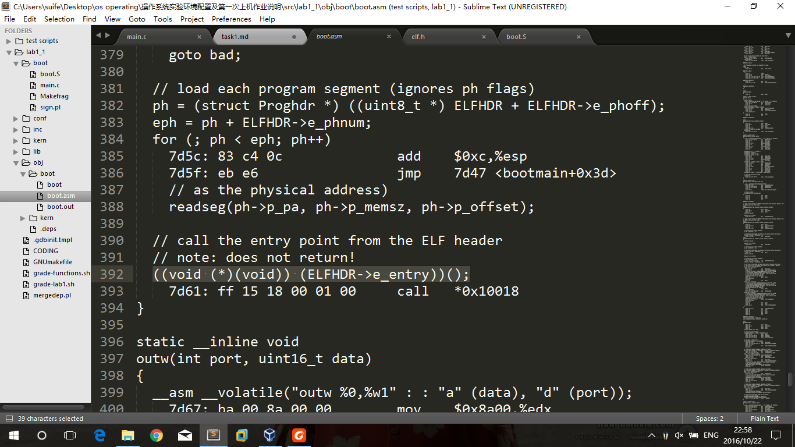
> 图为：boot.asm 中 void bootmain(void)函数最后一句

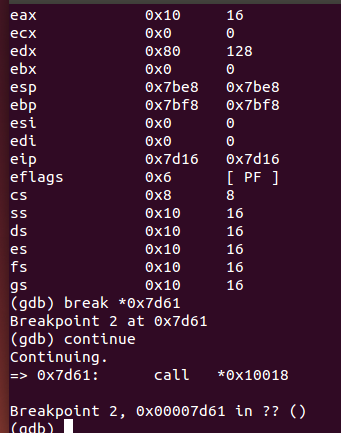
> 图为：boot.asm 中 void bootmain(void)函数最后一句反汇编结果

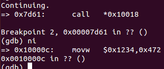
> 图为：entry.S 中 entry 字节第一句
## 1.3
在entry.S 中 entry 字节第一句
在内存中相对于段选择子0x10  偏移值为 0x10018 <br>
*explanation*

```c
#define ELFHDR      ((struct Elf *) 0x10000) // main.c
```
```c 
struct Elf {
    uint32_t e_magic;   // must equal ELF_MAGIC elf.h
    uint8_t e_elf[12];
    uint16_t e_type;
    uint16_t e_machine;
    uint32_t e_version;
    uint32_t e_entry;
    uint32_t e_phoff;
    uint32_t e_shoff;
    uint32_t e_flags;
    uint16_t e_ehsize;
    uint16_t e_phentsize;
    uint16_t e_phnum;
    uint16_t e_shentsize;
    uint16_t e_shnum;
    uint16_t e_shstrndx;
};
```
>根据以上代码和1.2.1代码可以知道，最后bootmain最后一句将32位整型ELFHDR->e_entry强制转换为函数指针并调用它,ELFHDR偏移地址为0x10000,ELFHDR->e_entry偏移地址为0x10000+4+1*12+2*2+4=0x10018
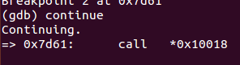
> 图为：内存偏移地址验证
## 1.4
### 1.4.1

```c
ph = (struct Proghdr *) ((uint8_t *) ELFHDR + ELFHDR->e_phoff);
eph = ph + ELFHDR->e_phnum;
for (; ph < eph; ph++)
    // p_pa is the load address of this segment (as well
    // as the physical address)
    readseg(ph->p_pa, ph->p_memsz, ph->p_offset);
```
>利用ELFHDR + ELFHDR->e_phoff找到 程序段 header表的偏移地址并赋值给ph
>利用ELFHDR->e_phnum 知道表条目 然后循环读取每一个sector
### 1.4.2
### 跳回目录 [目录](#catalog)
信息来源同1.3解释，来自elf.h
---
<span id="problem2"></span>
## 2.1
- 在系统载入内核执行后，会执行代码 <pre>call i386_init //entry.S</pre>
- 函数i386_init完成控制台初始化后会执行代码 <pre>cprintf("6828 decimal is %o octal!\n", 6828);//init.c</pre> 至此可看到控制台和printf.c接口的调用关系，控制台调用cprintf函数
- cprintf函数定义`cprintf(const char *fmt, ...)//printf.c`cprintf 函数主要通过以下语句实现其功能`cnt = vcprintf(fmt, ap);`其中cnt返回向控制台打印字符个数，fmt是打印字符流及格式说明，ap是一个可变参数变量
- vcprintf函数定义`vcprintf(const char *fmt, va_list ap)//printf.c`函数通过以下语句实现其功能`vprintfmt((void*)putch, &cnt, fmt, ap);`其中putch是类库提供的向控制台输出字符的函数
- vprintfmt函数定义`void vprintfmt(void (*putch)(int, void*), void *putdat, const char *fmt, va_list ap) //lib/printfmt.c`该函数通过putch向控制台打印字符，自己主要功能是实现字符串流扫描和逻辑判断
- putch 是指函数 `putch(int ch, int *cnt) //prinf.c ` 核心代码如下`cputchar(ch);`
- cputchar 函数定义如下 `cputchar(int c) //console.c` 核心代码如下`cons_putc(c);`
- cons_putc 代码如下
```c
static void
cons_putc(int c)
{
    serial_putc(c); //将字符打印到串行端口 
    lpt_putc(c); //拷贝控制台输出到并行端口
    cga_putc(c); //将字符打印到控制台
}
```
请转入下一问

## 2.2
- cga_putc(c) 函数将一个字符打印到字符设备cga(color graphic adapter)上
- crt_pos 是cga光标 
- crt_buf 是cga缓存首地址 
- CRT_COLS 是cga每一行的最大偏移地址量 
- CRT_SIZE 是cga可以显示的最大缓存数
- 查看定义<pre>memmove(void *dst, const void *src, size_t n)</pre>知memmove负责将大小为n的字节由源地址移到目标地址
- 据此解释以下代码
```c
if (crt_pos >= CRT_SIZE) { //如果光标位置大于等于cga最大缓存数
        int i;

        memmove(crt_buf, crt_buf + CRT_COLS, (CRT_SIZE - CRT_COLS) * sizeof(uint16_t));//将从第二行第一个地址开始，连续(CRT_SIZE - CRT_COLS)个字节移动到从第一行第一个地址开始的位置
        for (i = CRT_SIZE - CRT_COLS; i < CRT_SIZE; i++)
            crt_buf[i] = 0x0700 | ' ';//将cga缓存区最后一行用零填充
        crt_pos -= CRT_COLS;//将光标位置移到缓存区倒数第二行的末尾
    }
```
- 该代码段起到将屏幕第一行清空，其余行整体前移的目的
### 注解
- <span id="comment11"><small>**
 [注解1]
在Intel的保护模式架构中，大部分内存管理和中断服务例程都是通过解释器表控制达成。
解释器是一种存储结构来告诉cpu给定寄存器的属性
- **</small></span>
 <span id="comment12"><small>**
 [注解2]将32位整型ELFHDR->e_entry强制转换为函数指针并调用它<br>
 (void ((*)void)) <http://stackoverflow.com/questions/20357106/what-does-c-expression-voidvoid0-mean>
 **</small></span>
---
<span id="problem2.5"></span>
### 跳回目录 [目录](#catalog)
## 3.1
### 代码分析
```asm
movl   $0x5,(%esp)
call   f0100040 <test_backtrace>
```
>第一次进入test_backtrace 函数前将0x5压入栈顶,即 将该函数参数压入栈

```asm
push   %ebp
mov    %esp,%ebp
push   %ebx
sub    $0x14,%esp
mov    0x8(%ebp),%ebx
```
>进入test_backtrace 函数后将调用其的函数基地址压入栈，当前ebp指向调用其的函数的基地址
>将ebx压入栈，将esp指针指向低它14个字节的位置
>将ebx指向 高于ebp 8个字节的位置 即4字节数0x5的高地址的首字节位置

```asm
mov    %ebx,0x4(%esp)
movl   $0xf0101a20,(%esp)
call   f0100927 <cprintf>
```
>将ebx的值存到比esp高4个字节的位置，esp指向字符串"entering test_backtrace %d\n"的首地址，调用cprinf函数

```asm
test   %ebx,%ebx
jle    f010006b <test_backtrace+0x2b>
lea    -0x1(%ebx),%eax
call   f0100040 <test_backtrace>
mov    %eax,(%esp)
jmp    f0100087 <test_backtrace+0x47>
movl   $0x0,0x8(%esp)
movl   $0x0,0x4(%esp)
movl   $0x0,(%esp)
call   f0100786 <mon_backtrace>
```
>检查一下ebx是否不是负数如果是 跳到地址f010006b处（有关mon_backtrace处调用）
>此处ebx不是，则继续顺序运行，将ebx保存值进行减一运算移送到寄存器eax中，把eax保存值存入esp中(即为调用函数把参数保存入栈)，调用函数test_backtrace
>若ebx是负数，从高于esp 8个字节处开始，将mon_bactrace所需三个参数压入栈中调用执行

```asm
mov    %ebx,0x4(%esp)
movl   $0xf0101a3c,(%esp)
call   f0100927 <cprintf>
```
>调用 printf 思路同上

```asm
add    $0x14,%esp
pop    %ebx
pop    %ebp
ret    
```
>esp 指针指向高于它14个字节的地址，将原本保存的ebx值弹出到ebx，原本保存的ebp值弹出到ebp，弹出保存的eip到eip寄存器，本层函数调用结束
### 答案
一共10个字

- 调用其他函数时保存eip指针到栈中3字（两个printf，一个递归调用）
- 保存调用其的函数ebx，ebp值2个字，保存保存调用函数printf参数2*2个字
- 保存递归调用参数1字
---
<span id="problem3"></span>
### 跳回目录 [目录](#catalog)
## 3.0
答：x是uintptr_t类型。
理由：首先char*声明的是指向虚拟地址的指针，故value指向虚拟地址，而x是由value强制转换而来，类型相同，也应该为指向虚拟地址的指针，故为uintptr_t类型。如果x是physaddr_t类型，在对value强制转换时得不到想要的真实物理地址，代码发生错误，故不是physaddr_t类型。
---
<span id="problem4"></span>
## 4.1
### 4.1.1
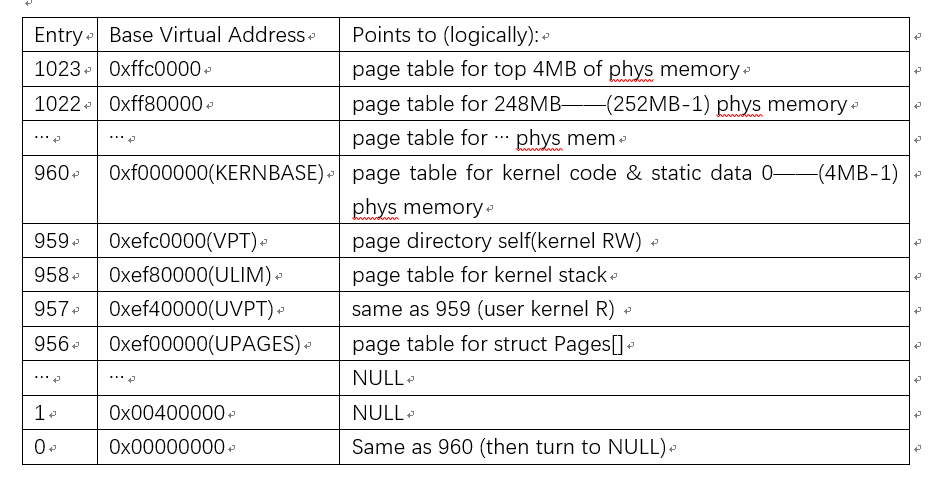
### 4.1.2
答：用户程序不能去随意修改内核中的代码、数据，否则可能会破坏内核，造成程序崩溃。
正常的操作系统通常采用两个部件来完成对内核地址的保护，一个是通过段机制来实现的，但是JOS中的分段功能并没有实现。二就是通过分页机制来实现，通过把页表项中的 Supervisor/User位置0，那么用户态的代码就不能访问内存中的这个页。
### 4.1.3
答：这个操作系统最大能支持的物理内存为2GB。
因为所有的页的PageInfo结构体信息被存放在一个4MB的UPAGES中，每个结构体的大小为8字节，所以一共可以存放512K个PageInfo结构体，即512K个物理页，而每个物理页大小为4KB，所以能支持的总的物理内存为2GB。
### 4.1.4
答：需要4MB存放所有的PageInfo，4KB存放页目录表kern_pgdir，2MB存放当前页表。所以总的开销就是6MB + 4KB。
一般来说，32位系统能寻址最大内存应该是4GB。而这里的UPAGES只有4MB所以是2GB，如果UPAGES是8MB，那么系统就可以寻址到4GB。
### 跳回目录 [目录](#catalog)
---
<span id="work1"></span>
## 书面作业第一个问题
## 添加代码内容
```c
case 'o':
            num = getuint(&ap, lflag);
            base = 8;
            goto number;
```
>lib\printfmt.c\vprintfmt
## 效果测试
### 测试代码

```c
cprintf(" this is work 1 insert:\n");
    cprintf(" this is hex number %02x  and this is oct number %02o \n" , 15,15);
```
>kern\monitor.c\mon_kerninfo
### 测试效果
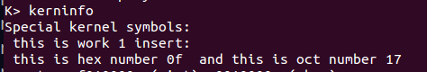
### 跳回目录 [目录](#catalog)
---
<span id="work2"></span>
## 书面作业第二个问题
## hook
```c
static struct Command commands[] = {
    { "help", "Display this list of commands", mon_help },
    { "kerninfo", "Display information about the kernel", mon_kerninfo },
    {"backtrace","Display a listing of function call frame",mon_backtrace},
};
```
>代码来源kern\monitor.c 
>分析代码知只需要增加结构中第三句话即可实现在monitor中调用栈内容打印函数
>另外由于testbacktrace函数设置，其实无需此钩子函数在内核载入时会自动调用并测试此函数  
## 编写函数

```c
int mon_backtrace(int argc, char **argv, struct Trapframe *tf)
{
    cprintf("start backtrace\n");
    uint32_t eip;
    uint32_t ebp = read_ebp();
    uint32_t esp;
    uint32_t args[5];
    uint32_t i = 0;
    while(ebp!=-1){
        esp = ebp+8;
        eip = *(uint32_t*)(ebp+4);
        if(ebp==0){
            ebp = -1;
        }else{
            ebp = *(uint32_t*)(ebp);
        }
        for(i=0;i<5;i++){
        args[i] = *(uint32_t*)(esp+i*4);
            }
        cprintf("ebp  %08x   eip %08x   args  %08x  %08x  %08x  %08x  %08x\n",ebp,eip,args[0],args[1],args[2],args[3],args[4]);
    }
    return 0;
}
```
>kern\monitor.c\mon_backtrace
## 代码解释
- jos所有函数调用都在一个栈中，且这个栈的总栈低是 0
- 当前函数 ebp 指向调用其函数ebp的值
- 当前函数 ebp+4 位置保存调用其函数调用其时的程序执行位置即eip
- 当前函数 ebp+8 即调用其函数的栈顶，调用其的函数的本地参数，调用函数的参数都保存在esp及以下连续多个位置
- 按此思路程序只需递归查找即可
## 测试效果
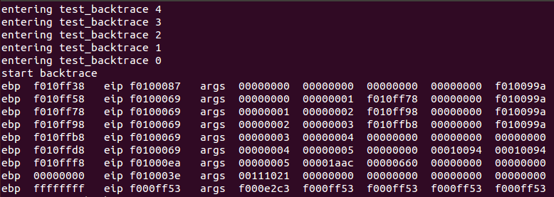
>嵌入内核执行结果

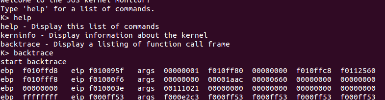
---
>控制台调用执行结果
>**说明**
嵌入内核的执行结果的参数说明该函数时编写正确的，比如第一行参数有三个0说明调用其的函数保存了该函数的参数在栈中，而通过kern中相关函数调用代码证明我观点正确。其后各个函数参数也可以印证这个观点
### 跳回目录 [目录](#catalog)
---
<span id="work3"></span>
## 书面作业第三个问题
## 编写函数与解释
### boot_alloc 代码
```c
static void *
boot_alloc(uint32_t n)
{
    static char *nextfree;    // virtual address of next byte of free memory
    char *result;

    // Initialize nextfree if this is the first time.
    // 'end' is a magic symbol automatically generated by the linker,
    // which points to the end of the kernel's bss segment:
    // the first virtual address that the linker did *not* assign
    // to any kernel code or global variables.
    if (!nextfree) {
        extern char end[];
        nextfree = ROUNDUP((char *) end, PGSIZE);
    }

    // Allocate a chunk large enough to hold 'n' bytes, then update
    // nextfree.  Make sure nextfree is kept aligned
    // to a multiple of PGSIZE.
    //
    // LAB 2: Your code here.
    if (n > 0) {
        result = nextfree;
        nextfree += ROUNDUP(n, PGSIZE); //按页分配，所以向上对齐
    }
    else if (n == 0)
        result = nextfree;
    else
        result = NULL;
    
    //test output
    //cprintf(">>  boot_alloc() was called! Entry(virtual address) of new page is: %x\n", (int)result);

    return result;        //result here is an virtual address
}
```
>kern\pmap.c\boot_alloc
### boot_alloc 解释
1.函数意义：分配大小为n的字节返回这块内存的起始地址，维护下一次分配地址起始位置nextfree
2.boot_alloc()维护了一个静态的指针nextfree，这个指针指向下一片空闲的内存块的起始地址。当nextfree第一次被使用时，该指针指向end符号“按PGSIZE个字节向上对齐（取整）”的地址 `nextfree += ROUNDUP(n, PGSIZE);` 其中 [PGSIZE](#comment31) [ROUNDUP](#comment32)
### page_init 代码

```c
void
page_init(void)
{
    // The example code here marks all physical pages as free.
    // However this is not truly the case.  What memory is free?
    //  1) Mark physical page 0 as in use.
    //     This way we preserve the real-mode IDT and BIOS structures
    //     in case we ever need them.  (Currently we don't, but...)
    //  2) The rest of base memory, [PGSIZE, npages_basemem * PGSIZE)
    //     is free.
    //  3) Then comes the IO hole [IOPHYSMEM, EXTPHYSMEM), which must
    //     never be allocated.
    //  4) Then extended memory [EXTPHYSMEM, ...).
    //     Some of it is in use, some is free. Where is the kernel
    //     in physical memory?  Which pages are already in use for
    //     page tables and other data structures?
    //
    // Change the code to reflect this.
    // NB: DO NOT actually touch the physical memory corresponding to
    // free pages!
    
    size_t i;
    for (i = 0; i < npages; i++) {
        pages[i].pp_ref = 0;
        pages[i].pp_link = page_free_list;  //save old node
        page_free_list = &pages[i];            //point to new node
    }                                        //growth of page_free_list
    
    //remove physical page 0 from page_free_list
    pages[1].pp_link = NULL;

    //remove continuous pages from page_free_list
    extern char end[];                        //this is an *virtual* address
    struct Page *ppg_start = pa2page((physaddr_t)IOPHYSMEM);                                                //at low *physical* address
    struct Page *ppg_end = pa2page((physaddr_t)((end - KERNBASE) + PGSIZE + sizeof(struct Page)*npages));    //at high *physical* address

    //test output
    //cprintf(">>  ppg_start: %x\tppg_end: %x\n", (int)ppg_start, (int)ppg_end);

    ppg_start--;    ppg_end++;
    ppg_end->pp_link = ppg_start;
}
```
>kern\pmap.c\page_init
### page_init 解释
1.函数意义：利用[pages[]](#comment33)初始化名为page_free_list的可使用物理页管理器（单向链表结构）
2.开始for循环将所有内存物理页连接为单向链表，形成最原始page_free_list
3.拆掉page[0] （见代码上注释1）
4.拆掉为IO预留的物理页和kern代码所在物理页。此处具体说明如下

- 之所以可以两块空间同时拆掉是因为(physaddr_t)EXTPHYSMEM = (physaddr_t)((entry - KERNBASE)
- ppg_start，ppg_end 分别是page[]的下标。其中[pa2page](#comment34)将物理地址转换成其对应物理页管理结构Page的下标
- 转换过程可用图示表示
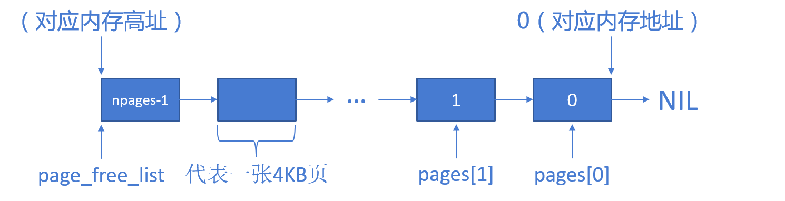
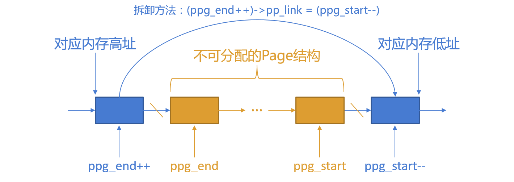

### page_alloc 代码
```c
struct Page *
page_alloc(int alloc_flags)
{
    //test output
    //cprintf(">>  page_alloc() was called!\n");

    if (page_free_list == NULL)
        return NULL;

    struct Page *result = page_free_list;
    page_free_list = page_free_list->pp_link;
    
    if (alloc_flags & ALLOC_ZERO)
        memset(page2kva(result), 0, PGSIZE);
        
    return result;
}
```
>kern\pmap.c\page_alloc
### page_alloc 解释
1.函数意义：分配一个物理页并返回管理该物理页Page结构的首地址，更新page_free_list，如果(alloc_flags & ALLOC_ZERO)为真，用0填充该物理页。[注解5](#comment35)

### page_free 代码
```c
void
page_free(struct Page *pp)
{
    //test output
    //cprintf(">>  page_free() was called!\n");

    pp->pp_link = page_free_list;
    page_free_list = pp;
}
```
>kern\pmap.c\page_free
### page_free 解释
1.函数意义：不解释
### 运行结果
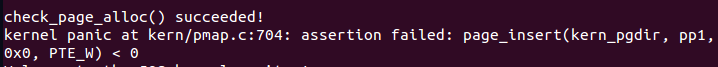
>代码说明check_page 函数进入，在page_insert处发生错误，这意味着boot_alloc，page_init,page_alloc断言没有出错调用成功
### 注解
- <span id="comment31">
[注解1]`define PGSIZE      4096        // bytes mapped by a page`
</span>

- <span id="comment32">
[注解2]
```c
#define ROUNDUP(a, n)                       \
({                              \
    uint32_t __n = (uint32_t) (n);              \
    (typeof(a)) (ROUNDDOWN((uint32_t) (a) + __n - 1, __n)); \
})
```
</span>

- <span id="comment33">
[注解3] `pages = (struct Page *)boot_alloc(npages * sizeof(struct Page));`page[]用来追踪所有物理页。<br>
其中Page结构 `struct Page { struct Page *pp_link; uint16_t pp_ref; };`pp_ref记录该物理页被引用次数，pplink连接下一个物理页管理项Page结构地址
</span>

- <span id="comment34">
[注解4] 
```c
static inline physaddr_t page2pa(struct Page *pp)
{
    return (pp - pages) << PGSHIFT;
}

#define PGSHIFT     12      // log2(PGSIZE)
```
</span>

- <span id="comment35">
[注解5] 
```c
static inline void*
page2kva(struct Page *pp)  //返回 pp 管理的物理地址的kern虚地址首地址
{
    return KADDR(page2pa(pp));
}

/* This macro takes a physical address and returns the corresponding kernel
 * virtual address.  It panics if you pass an invalid physical address. */
#define KADDR(pa) _kaddr(__FILE__, __LINE__, pa)
```
</span>
### 跳回目录 [目录](#catalog)
---
<span id="work4"></span>

## 书面作业第四个问题
## 编写函数与解释
### pgdir_walk 代码
```c
pte_t *
pgdir_walk(pde_t *pgdir, const void *va, int create)
{
    // Fill this function in
    pte_t *result;
    if (pgdir[PDX(va)] == (pte_t)NULL) {            //yet to create
        if (create == 0)
            return NULL;
        else {
            struct Page *tmp = page_alloc(ALLOC_ZERO);
            if (tmp == NULL)
                return NULL;                        //failed to alloc
            else {
                tmp->pp_ref++;
                pgdir[PDX(va)] = page2pa(tmp) | PTE_P | PTE_W |PTE_U;    //save the physical address of newly allocated page in page dir
                result = page2kva(tmp);                                    //translate into an virtual address for kernel use
            }
        }
    }
    else                        
        result = page2kva(pa2page(PTE_ADDR(pgdir[PDX(va)])));
    return &result[PTX(va)];
}

```
>kern\pmap.c\pgdir_walk
### pgdir_walk 解释

1. 函数意义：返回线性地址va所在二级页表的页表项首地址的物理地址。如果该页表项不存在则依据参数create处理，当create为真时分配一个物理页并建立管理该页页表项所在的二级页表，否则返回空指针。
2. [PDX](#comment41)(va)返回管理线性地址va的二级页表所对应的一级页表页表项下标。
3. pgdir[PDX(va)] = page2pa(tmp) | PTE_P | PTE_W |PTE_U;建立管理包括va的二级页表，并设立flag位，详见下图
4. result 保存管理va的页表项所在的二级页表的线性地址
5. PTE_ADDR(pgdir[PDX(va)]) 得到的是管理（管理va的二级页表）的Page结构的首地址
6. **无论是页目录（Page Directory，即一级页表）还是页表（Page Table，即二级页表），保存的都是物理地址而不是虚拟地址。因为整个地址的转换实际上是由qemu模拟的mmu（Memory Management Unit，内存管理单元）硬件实现的，如果保存的是虚拟地址，就增加了mmu查表的次数，显然会影响kernel的速度。但是，kernel访问表和表项时又只能通过虚拟地址，这时我们可以用“kern/pmap.h”中的另一个函数page2kva()。**
7. 页表管理参照图标<br>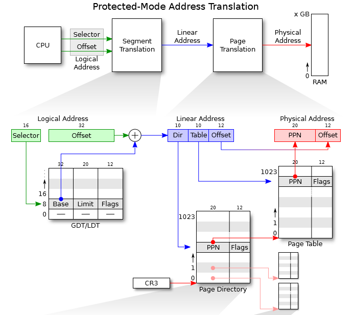

### page_lookup 代码
```c
struct Page *
page_lookup(pde_t *pgdir, void *va, pte_t **pte_store)
{
    //test output
    //cprintf(">>  page_lookup() was called!\n");
    
    pte_t *pte = pgdir_walk(pgdir, va, 0);
    if (pte == NULL)
        return NULL;

    if (pte_store != 0)
        *pte_store = pte;

    return pa2page(PTE_ADDR(pte[0]));
}
```
>kern\pmap.c\page_lookup
### page_lookup 解释

1. 函数意义：返回虚拟地址“va”映射到的物理页框对应的Page结构的物理地址。
2. pte 是“va”映射到的物理页框对应的二级页表页表项
3. pa2page(PTE_ADDR(pte[0])); 通过pte的首地址得到该页表项即一个Page结构的物理地址


### page_remove 代码
```c
void
page_remove(pde_t *pgdir, void *va)
{
    //test output
    //cprintf(">>  page_remove() was called!\n");
    
    pte_t *pte;
    struct Page *page = page_lookup(pgdir, va, &pte);
    
    if (page != NULL)
        page_decref(page);
        
    pte[0] = 0;
    tlb_invalidate(pgdir, va);
}
```
>kern\pmap.c\page_remove
### page_remove 解释

1. 函数意义：函数用来断开虚拟地址“va”当前在页目录“pgdir”中的映射。我们需要用page_lookup()查找是否存在“va”对应的Page结构，如果不存在，我们需要用0抹掉该页表中对应的表项（尽管不存在对应的表项，但是还是抹掉以防万一），然后使“va”对应的TLB（Translation Lookaside Buffer，现在一般翻译为“快表”）失效；如果存在，我们需要尝试调用page_decref()减少该Page结构的pp_ref（即页面引用次数），这一过程中如果页面引用次数降为0，则由page_decref()释放该页面（放回page_free_list链表中），之后还需要用0抹掉该页表中对应的表项，最后同样地也需要让TLB失效。

### page_insert 代码
```c
int
page_insert(pde_t *pgdir, struct Page *pp, void *va, int perm)
{
    //test output
    //cprintf(">>  page_insert() was called!\n");
    
    struct Page *page = page_lookup(pgdir, va, NULL);
    pte_t *pte;
    
    if (page == pp) {                       //re-insert into the same place
        pte = pgdir_walk(pgdir, va, 0);
        pte[0] = page2pa(pp) | perm | PTE_P;
        return 0;
    }
    
    if (page != NULL)                       //remove original page if existed
        page_remove(pgdir, va);
        
    pte = pgdir_walk(pgdir, va, 1);
    if (pte == NULL)
        return -E_NO_MEM;

    pte[0] = page2pa(pp) | perm | PTE_P;
    pp->pp_ref++;
    return 0;
}
```
>kern\pmap.c\page_insert
### page_insert 解释

1. 函数意义：对于给定的页目录“pgdir”，把虚拟地址“va”映射到给定的物理页框对应的Page结构“pp”上，同时设置低12位的标志位为“perm”。

+ 为了实现这一功能，我们需要用page_lookup()查找“va”在“pgdir”中是否已经映射到了某一个Page结构上，如果否，说明可以直接建立“va”到“pp”的映射；如果是，就有两种可能：
　　* “va”已经映射到了“pp”上
　　* “va”映射到了“pp”以外的Page结构上
2. 对于第一种情况，我们只需要修改低12位的标志位即可。对于第二种情况，我们需要调用page_remove()断开原有的映射，然后再建立新的映射。注意，所谓的建立映射，实质上就是修改Page Table中对应的<PPN Flags>项，该项可以用pgdir_walk()得到

### 运行结果
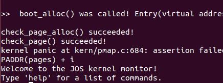
>代码说明check_page函数调用成功，则以上所有函数编写功能没有问题。
### 注解
- <span id="comment41">
`#define PDX(la)     ((((uintptr_t) (la)) >> PDXSHIFT) & 0x3FF) // page directory index`
</span>

- <span id="comment42">
`#define PTE_ADDR(pte)   ((physaddr_t) (pte) & ~0xFFF)  // Address in page table or page directory entry `
</span>

- <span id="comment43">
[注解3] `pages = (struct Page *)boot_alloc(npages * sizeof(struct Page));`page[]用来追踪所有物理页。<br>
其中Page结构 `struct Page { struct Page *pp_link; uint16_t pp_ref; };`pp_ref记录该物理页被引用次数，pplink连接下一个物理页管理项Page结构地址
</span>
### 跳回目录 [目录](#catalog)
---
<span id="work5"></span>

## 书面作业第五个问题
## 编写函数与解释
### 权限与故障分离
```c
//////////////////////////////////////////////////////////////////////
    // Now we set up virtual memory

    //////////////////////////////////////////////////////////////////////
    // Map 'pages' read-only by the user at linear address UPAGES
    // Permissions:
    //    - the new image at UPAGES -- kernel R, user R
    //      (ie. perm = PTE_U | PTE_P)
    //    - pages itself -- kernel RW, user NONE
    // Your code goes here:
    size_t i;
    for (i = 0; i < ROUNDUP(npages*sizeof(struct Page), PGSIZE); i += PGSIZE)
        page_insert(kern_pgdir, pa2page(PADDR(pages) + i), (void *)(UPAGES + i), PTE_U);

    //////////////////////////////////////////////////////////////////////
    // Use the physical memory that 'bootstack' refers to as the kernel
    // stack.  The kernel stack grows down from virtual address KSTACKTOP.
    // We consider the entire range from [KSTACKTOP-PTSIZE, KSTACKTOP)
    // to be the kernel stack, but break this into two pieces:
    //     * [KSTACKTOP-KSTKSIZE, KSTACKTOP) -- backed by physical memory
    //     * [KSTACKTOP-PTSIZE, KSTACKTOP-KSTKSIZE) -- not backed; so if
    //       the kernel overflows its stack, it will fault rather than
    //       overwrite memory.  Known as a "guard page".
    //     Permissions: kernel RW, user NONE
    // Your code goes here:
    for (i = 0; i < KSTKSIZE; i += PGSIZE)
        page_insert(kern_pgdir, pa2page(PADDR(bootstack) + i), (void *)(KSTACKTOP-KSTKSIZE + i), PTE_W);

    //////////////////////////////////////////////////////////////////////
    // Map all of physical memory at KERNBASE.
    // Ie.  the VA range [KERNBASE, 2^32) should map to
    //      the PA range [0, 2^32 - KERNBASE)
    // We might not have 2^32 - KERNBASE bytes of physical memory, but
    // we just set up the mapping anyway.
    // Permissions: kernel RW, user NONE
    // Your code goes here:
    for (i = 0; i < 0xFFFFFFFF - KERNBASE; i += PGSIZE) {
        page_insert(kern_pgdir, pa2page(i % (npages*PGSIZE)), (void *)(KERNBASE + i), PTE_W);
        pa2page(i % (npages*PGSIZE))->pp_ref--;                 //this statement is to keep pp_ref == 0 in page_free_list
    }

```
>kern\pmap.c\mem_init
### 权限与故障分离 解释

1. 第一段代码建立pages[]数组所在的物理页框到虚拟地址UPAGES的映射，且标志位设置为“内核只读，用户只读”（PTE_U）
2. 第二段代码建立bootstack所在的物理页框到虚拟地址KSTACKTOP的映射，且标志位设置为“内核可读可写，用户无权限”（PTE_W）。
3. 第三段代码建立物理地址[0, 2^32 - KERNBASE)所在的物理页框到虚拟地址[KERNBASE, 2^32)的映射，且标志位设置为“内核可读可写，用户无权限”（PTE_W）。我们在第三部分的映射中已经修改了所有Page结构的引用次数pp_ref，而check_page_installed_pgdir()中的assert()断言默认所有Page结构一开始都是没有被引用的（即pp_ref == 0），所以我们需要额外去修改pp_ref。pa2page(i % (npages*PGSIZE)处理如果实际内存比4g要小时，物理页和虚拟地址的对应关系。

### 运行结果
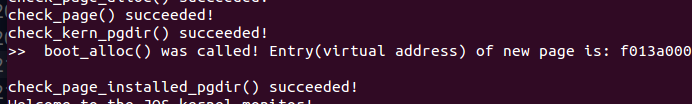
>代码说明以上编写功能没有问题。
### 跳回目录 [目录](#catalog)
---
## 参考资料
- jos 环境配置 <http://www.cnblogs.com/LostChristmas/p/5987381.html>
- cga_putc的理解<http://m.blog.chinaunix.net/uid-26795923-id-3222038.html>
- test ebx ebx& jl<http://stackoverflow.com/questions/10855296/jl-after-test-in-assembly>